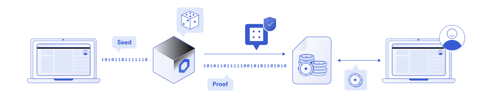

# About Sakura Casino

!!!warning

SakuraCasino roulette is in beta. Our contract hasn't been audited yet. Please be sure to know the risks before betting or pooling.

!!!

[SakuraCasino](https://sakura.casino) is a decentralized online casino based on the [Polygon (Matic)](https://polygon.technology/) network.
The casino consists of a roulette contract deployed in the *Matic mainnet* with an UI that interacts with that contract.

---

### Randomness beacon

SakuraCasino uses [Chainlink VRF](https://chain.link/solutions/chainlink-vrf), which is a verifiable random function for smart contracts provided by Chainlink's oracle network.

This is the first [**provably-fair**](https://en.wikipedia.org/wiki/Provably_fair_algorithm) crypto roulette with true random number generation.

!!!secondary

Most Solidity-based DApps use other sources for randomness, like the *blockhash*, but those have been proven to be [vulnerable and biasable](https://betterprogramming.pub/how-to-generate-truly-random-numbers-in-solidity-and-blockchain-9ced6472dbdf).

!!!

---

### Low fees and DAI betting

The roulette is deployed in the *Matic network* because of its low fees to operate. Making a bet cost less than a cent and you can use the [DAI Stablecoin](https://makerdao.com/).

Pooling and earning interest on the Roulette earnings is open to everyone. 

---

### Non-KYC and censorship resistance

The Roulette contract is deployed in the blockchain. It cannot be modified or tampered with. Anyone with a *Matic wallet* and *DAI tokens* can bet or provide liquidity by simply interacting with the contract.

There's a nice user interface deployed at [app.sakura.casino](https://app.sakura.casino/) for interacting with the contract. You can also clone our open source [Github repository](https://github.com/sakuracasino/roulette-ui) and run the DApp locally.

!!! Why DAI?

We use *DAI* because it's the only stablecoin that can't have blacklisted address (unlike [USDT](https://www.theblockcrypto.com/linked/80249/tether-blacklist-addresses-ethereum) or [USDC](https://www.theblockcrypto.com/linked/102761/centre-consortium-blacklisted-seven-usdc-addresses-wednesday)). Another benefit is that *DAI* is not dependant on any goverment or entity to [secure its collaterals](https://makerdao.com/en/whitepaper/#collateral-assets).

!!!

---

## Support

Our software it's still in an early stage and we have a lot of ideas for future functionality. Be sure to join us in our [Discord server](https://discord.gg/DHux5uEvrJ) and get involved with the project.