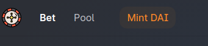

# Getting Started

This guide is useful if you want to contribute or just want to locally run the application instead of using our domain to connect to the UI.

There're two github repositories:

* **[sakuracasino/roulette-ui](https://github.com/sakuracasino/roulette-ui)** which contains the source code for running the UI in [app.sakura.casino](https://app.sakura.casino).

* **[sakuracasino/roulette-contract](https://github.com/sakuracasino/roulette-contract)** which contains contract's source code aswell as its testing environment.

### Setting up the UI locally

You can follow the `README.md` file in the repository, but it should work with the following steps.

1. Make sure to have `nodejs` and `npm` installed.
2. Clone the repository
3. Run `npm intall` and then `npm start`
4. The UI should be running at `http://localhost:9000/`

#### Using kovan testnet

If you want to make experiments or develop the UI only, you can connect to the `Kovan` testnet using Metamask. `Kovan` is meant for testing purposes so you can do what you want there. There's a [kovan faucet](https://gitter.im/kovan-testnet/faucet) where you can get some test ETH to get started.

Since we use a mocked version of `DAI` with unlimited minting, there's a `Mint DAI` button where you can get some test `DAI` for free.

!!! Pro tip

You don't need to run a local server to try the roulette with the Kovan testnet, you can just switch to Kovan while using the app deployed in our server.

!!!

### Setting up the Contract development environment

If you wish to try developing features for the contract, you can clone the `sakuracasino/roulette-contract` repository and run it with `npm` too. Please read the readme for this reference.

Additionally, this repository is synced with its own [npm package](https://www.npmjs.com/package/@sakuracasino/roulette-contract) that exports the *contract's ABI* and network addresses to be consumed by the frontend app.

Please read the following [contract documentation](/development/contract) to get to know this repository better.