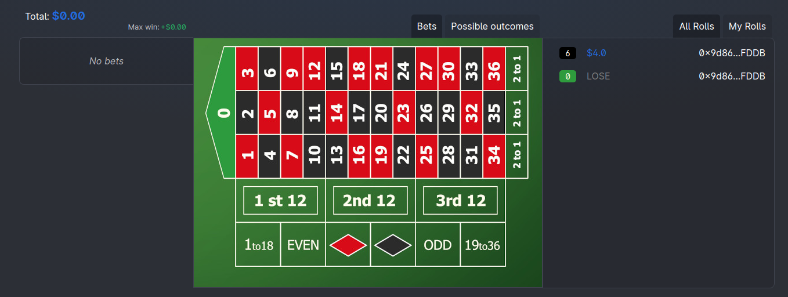
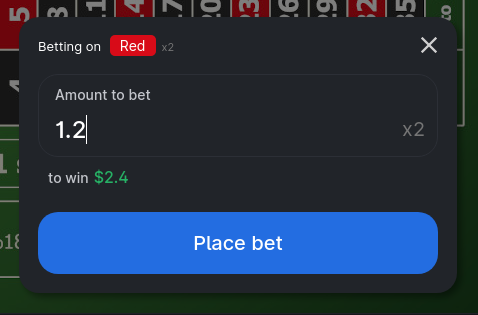
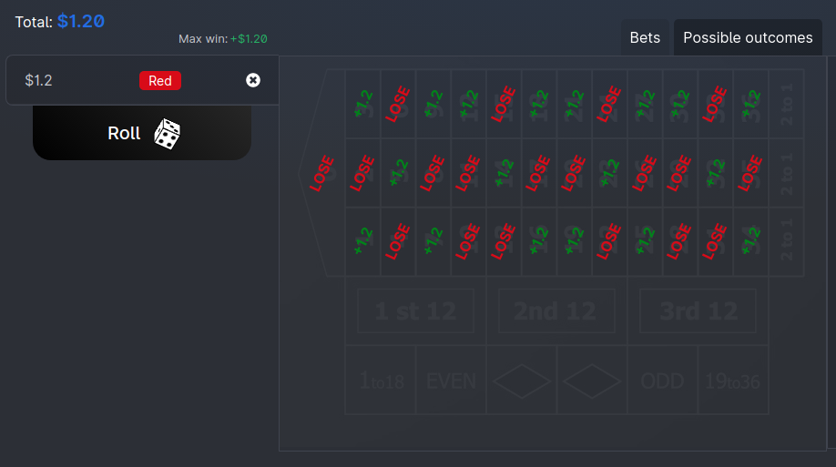
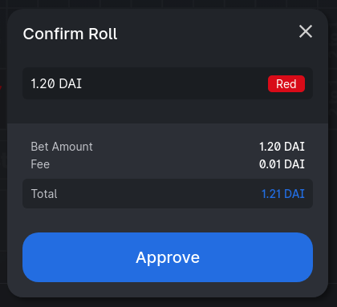
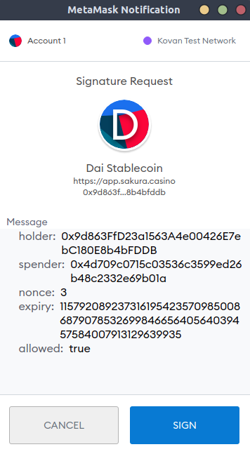
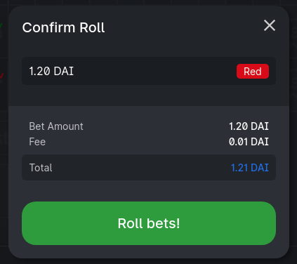
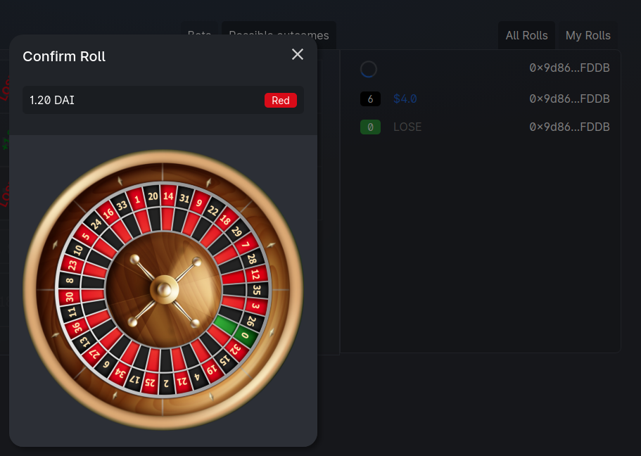
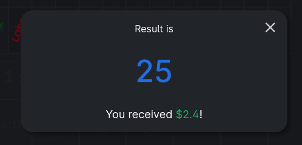

# Placing bets

Once you're connected to SakuraCasino's roulette app. You'll be able to make bets.
The user interface is very simple; it consists of three parts:

1. A *bet history* showing the lastest bets from everyone and your previous bets.
2. The *bet placing area* where you have an interactive roulette layout to place bets. It also contains a *"Possible outcomes"* tab with the expected money gain/loss for each possible result.
3. A *bet list* with all the bets you've placed. Here you can *Roll* and play that set of bets.

### Type of bets

As of any european roulette, you have multiple bet types.

* By **Number** (x36 if you win)
* By **Dozen** (x3 if you win)
* By **Column** (x3 if you win)
* By **Half** (x2 if you win)
* By **Color** (x2 if you win)
* By **Parity** (x2 if you win)

You can do any combination of these bets before rolling.

Select you desired bet by clicking on the layout. A popup will show up. There, input how much you want to bet and you will see how much would you earn in case you win.

### Checking your bets

After you have placed your bets, they will appear on the left side. There you can see the details, the total amount and the maximum you can win.

If you click on the **Possible outcomes** tab, you can check how much you'd earn for each possible result.

### Rolling your bets

To roll your currently placed bets, you can click on the **Roll** button and it will present a popup with the final amount you have to pay: this includes all the bets plus a small fee to pay for the random number generation.

Since we're using the *Matic network*, the fee is very low: only `$0.01` per roll, no matter the amount.

!!! Random Fee

Chainlink's random number fee is very low on the *Matic network*. In *Binance Smart Chain* is arround `$6.00` and in the *Ethereum network* is arround `$60.00`.

We're planning to deploy the roulette contract too in *BSC* and *ETH* when fees are lowered.

!!!

#### Approve and roll

There're two buttons for rolling your bets: `Approve` and `Roll bets!`.

**Approve** will ask for a wallet signature to allow the roulette to spend your *DAI tokens*.

**Roll bets** will send the roll to the roulette's contract. You have to pay a small *Matic* fee for executing this function.

!!! DAI's permit signature

A great feature of using *DAI* to pay for rolls is that the approving function is free of fees because it uses a wallet signature instead of a contract function.

In some other ERC-20 tokens like *USDC* or *USDT* you have to make an additional transaction for approving the tokens. That makes it more expensive to interact with the contract

!!!

### Roll queue

After sending a roll, you'll see a roulette animation meaning the roll was sent and it's waiting for the random number to arrive. It can take several seconds or much minutes.
You can also see your pending roll in the list on the right.

Nothing will happen if you close or refresh the page. Independenly of what you do, you'll later have a popup with the result number and how much earned or loss. In case you win some, the funds will automatically be sent to your wallet.

