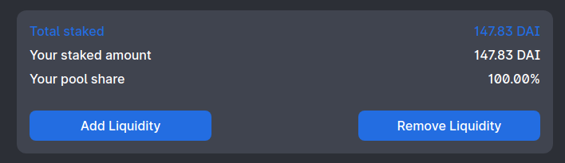
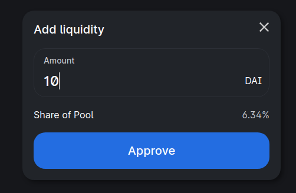

# Pooling

!!!warning
SakuraCasino roulette is in beta. Our contract hasn't been audited yet. Please be sure to know the risks before betting or pooling.
!!!

Currently, anyone can be a liquidity provider for the roulette contract.

If you decide to add liquidity, pool shares will be printed, represented with the *`SV1` ERC-20 token*.
Because of the nature of roulette probabilities, when people play, the expected value of the pool with grow while you ownership percentage will remain the same. This will allow you to collect interests from pooling.

!!! Future of the liquidity protocol
On the current version, there's no limit how much you can pool and how many shares can be printed. It will remain like that for this contract, forever.

However, we're exploring more efficcient liquidity provisioning protocols for future versions of the casino. You can check those in our [roadmap](/roadmap).
!!!

### How to provide liquidity

Go to the [application interface](https://app.sakura.casino) and select the tab  `Pool`. There you'll have an interface with the current total liquidity and your deposited liquidity and pool percentage.

If you click on *Add Liquidity* a popup will open, there you have to put how much you wish to add. 

If you wish to withdraw your current liquidity, just click on *Remove liquidity*.

### Examples

Here are some examples of what can happen to the provided liquidity:

#### Basic example
* Pool has `1000 DAI` initially
* You provide `100 DAI` in liquidity, making it `1100 DAI` now.
* You're minted the equivalent token shares of `~9.09%`
* After a while the pool grows from `1100 DAI` to `2000 DAI` because of bets
* You now have `2000 * 9.09% = 181.81 DAI` available to withdraw.

#### Share dilution
* Pool has `1000 DAI` initially
* You provide `100 DAI` in liquidity, making it `1100 DAI` now.
* You're minted the equivalent token shares of `~9.09%`
* Another person provides an additional `100 DAI` in liquidity, making it `1200 DAI` now.
* More shares were printed, so your percentage gets diluted to `~8.33%`
* After a while the pool grows from `1100 DAI` to `2000 DAI` because of bets
* You now have `2000 * 8.33% = 166.60 DAI` available to withdraw.

!!!success

You'll always earn DAI, but the grow rate can decrease if more people join the pool.

To be clear, it's similar to how [Uniswap pools work](https://uniswap.org/docs/v2/advanced-topics/fees/#liquidity-provider-fees). Instead of fees earnings come from the roulette odds.

!!!
