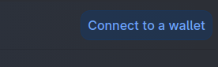
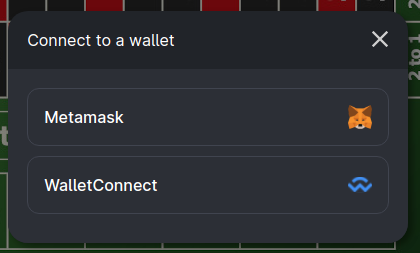
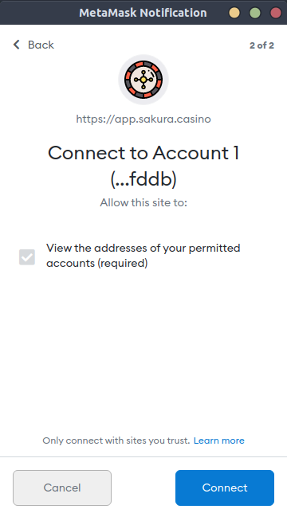
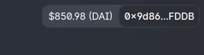

# Set up wallet

[Sakura Casino](https://sakura.casino) is deployed in [Polygon](https://polygon.technology/) (Matic network) for production use; and in [Kovan testnet](https://kovan-testnet.github.io/website/) for testing purposes. If you have the [Metamask](https://metamask.io/) extension installed, make sure to [add the Matic mainnet](https://docs.matic.network/docs/develop/metamask/config-matic) to it.

### Steps to get Metamask ready

1. Install the [Metamask extension](https://metamask.io/) and configure your Ethereum wallet.
2. Get some ETH or DAI in your Ethereum wallet.
3. Configure the Matic mainnet in metamask following [this guide](https://docs.matic.network/docs/develop/metamask/config-matic).
4. Move funds from Ethereum to Matic using the [Matic bridge](https://wallet.matic.network/bridge)
5. Buy some DAI in [QuickSwap](https://quickswap.exchange/#/swap).
6. Your Metamask wallet is ready to be used in *Sakura Casino*.

---

### Connect a wallet

For connecting your wallet to the [roulette app](https://app.sakura.casino/), click on the `Connect to a wallet` button on the upper right.

This will open a dialog where you can choose to connect through the *Metamask wallet*.

You'll see a popup from your *Metamask wallet* where you'll be asked to confirm the connection with the app.

Once you're ready, you should be able to see your wallet's balance in the app.

